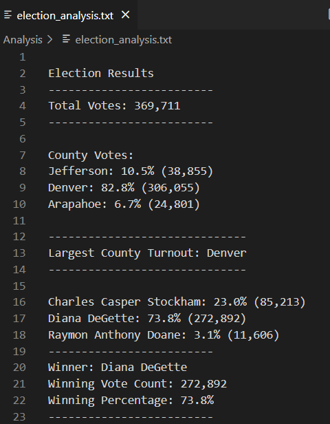

# Demonstration of Python Election Analysis for BootCamp 

## Analysis
Analysis of election results using python to read in a csv file and provide the following deliverables
1. The Election Results Printed to the Command 
2. The Election Results Saved to a Text File
3. A written Analysis of the Election audit

## Overview of Election Audit:
The Colorado Board of Elections has requested an audit of a recent local election with the folowing specified "asks":

    * Total number of votes cast
    * A complete list of candidates who received votes
    * Total number of votes each candidate received
    * Percentage of votes each candidate won
    * The winner of the election based on popular vote

The election commision also asked for some additional data to complete the audit:

    * The voter turnout for each county
    * The percentage of votes from each county to the toal count
    * The county with the highest turnout

The results are expected to be provided (to the terminal and in a text file) using the following template:

## Resources
* Data Source: election_results.csv
* Software: Python 3.10, Visual Studio Code 

## Election-Audit Results: 
Guidance: Using a bullted list, address the following election outcomes. Use images or Python code as a support where necessary.

### Specified "Asks:"
* How many votes were cast in this election?
    - Total_Votes: 369,711
* A complete list of candidates who received votes
    - Charles Casper Stockham
    - Diana DeGette
    - Raymon Anthony Doane
* Total number of votes each candidate received
    - Charles Casper Stockham: 85,213
    - Diana DeGette: 272,892
    - Raymon Anthony Doane: 11,606
* Percentage of votes each candidate won
    - Charles Casper Stockham: 23.0% 
    - Diana DeGette: 73.8% 
    - Raymon Anthony Doane: 3.1%
* The winner of the election based on popular vote

## Results as recorded in my election_analysis.txt.file

## Election-Audit Python Code Summary:
Future state wide elections could use this Python code by uploading CSV file that correlates with the election at hand.
Election officials can modify codes as needed by specifing year and location of data used in CSV files. 
 

